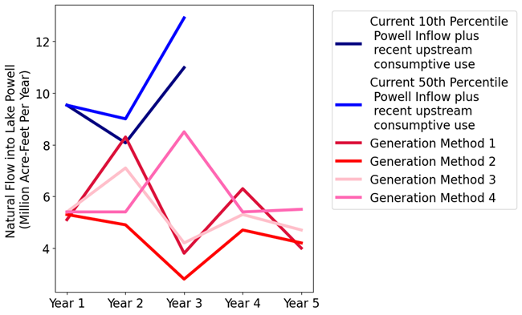

# Immersive Model for Lake Mead Based on the Principle of Division of Reservoir Inflow

### [Lets Start (visual directions)](https://github.com/ImmersiveModelsColoradoRiver/LakeMeadDivideInflow/blob/main/ImmersiveModelLakeMeadDivideInflow-LetsStart.pdf) (pdf file)
### [Model Guide](https://github.com/ImmersiveModelsColoradoRiver/LakeMeadDivideInflow/blob/main/ModelGuide/ModelGuide-LakeMeadWaterBank.md) (Help file)
### [Model File](LakeMeadWaterBankDivideInflow.xlsx) (Excel)
### [Draft Manuscript](https://github.com/ImmersiveModelsColoradoRiver/LakeMeadDivideInflow/raw/refs/heads/LakeMeadWaterConservationProgramAnalysis.docx) (Microsoft WORD)

## Purpose														
The purpose of this tool is to give users the opportunity to immerse in and
personify water user roles for a Lake Mead model based on the principle of
divide reservoir inflow. The process is: **A) Divide reservoir inflow**, **B)
Subtract evaporation**, and **C) Users withdraw and conserve within their
available water**, others choices, and real-time discussion of choices. We see
uses of the tool for three purposes:

- To improve NOAA tools to communicate and manage risks of water shortages.

-   As researchers we want to learn *Why* basin partners choose assumptions and
    *how* extreme; *Why* and *how* basin partners articulate their risk of
    uncertain future water supply and manage their vulnerability; and *Which*
    new insights they take from a model session.

-   Provoke thought and discussion to:

    -   Stabilize and recover reservoir storage under conditions of low storage
        *and* low inflow.

    -   Give users more autonomy to manage their conflicting vulnerabilities to
        water shortages.

# Key Model Ideas

1. There is borad agreement that Colorado River flows will be more volative, declining, and have longer-lasting periods of flow.

      

2.  **Lake Mead water level is the sum of the protection elevation plus each
    user’s available water.**

    

3.  **Each user manages all their available water not just prior conserved
    water.**

To use, download the [Excel Model File](https://github.com/ImmersiveModelsColoradoRiver/LakeMeadDivideInflow/raw/refs/heads/main/LakeMeadWaterBankDivideInflow.xlsx), 
move to Google Sheets, and invite participants. There are accounts for Reclamation (Protect Zone), California, Arizona, Nevada, Mexico, and Tribal Nations in the Lower Basin.
Over one or more years, participants consume, save, and trade water in the accounts. Read on for directions to use.

## Requirements
**Session Guide**: 1 person to setup in Google Sheets (see Setup below), invite participants, and organize play.											

**Number of People**: 2 or more (Session Guide may also participate).

**Time**: 1 to 3 hours.

**Software**: Session Guide has a Google Account.

## Directions to Guide a Model Session

**Setup**
1. Download the file **[LakeMeadWaterBankDivideInflow.xlsx](https://github.com/ImmersiveModelsColoradoRiver/LakeMeadDivideInflow/raw/refs/heads/main/LakeMeadWaterBankDivideInflow.xlsx)** to your computer.
1. Move the Excel file to your Google Drive. Open as a Google Sheet.
1. Open the **Versions** Worksheet to see updates.
1. Duplicate the **Master** Worksheet to work on in this session and save a blank version for later use. 
1. Invite 1 or more other people to join the Google Sheet.
   1. In the upper right of the Google Sheet, click the **Share** button.
   1. Add emails, and set permissions so players can access the Google Sheet. Or copy and share the sheet's URL. 

**Use**
1. On the **Master** Worksheet, scroll down Column A. Participants enter values in rows with 🟦 `Blue text`
   1. For example, in Rows 4-10, particants select a **User** and enter the **User's Vulnerability**, and **Strategy to manage vulnerability**. If fewer than 6 participants, participants select multiple parties.
   1. In 🟩 `Cell B19`, enter the Lake Mead starting storage. Find current elevation [here](https://www.usbr.gov/lc/region/g4000/hourly/mead-elv.html).
   1. In 🟩 `Cell B20`, the Reclamation user sets the elevation for the protection zone - Lake Mead will never fall below this level.
   1. In  🟩 `Cell B21`, enter the total Water Conservation Account (Intentionally Created Surplus) Balance. This value includes California, Arizona, Nevada, and Mexico.
   1. Enter the Lake Mead Inflow for Year 1 in 🟩 `Cell C28`. Cells below will populate.
   1. Participants continue to enter values in Year 1 (Column C) down to Row 137 in row blocks with 🟦 `Blue text`.
1. Move to Year 2 (Column D). Enter Lake Powell natural flow in 🟩 `Cell D28`.
1. Find linked help for each row in 🟨 `Column N`.
1. The **ReadMe-Directions** Worksheet also has these directions and describes all worksheets in the Workbook.
  
## Further Reading
1. Rosenberg, D. E. (2022a). "Adapt Lake Mead Releases to Inflow to Give Managers More Flexibility to Slow Reservoir Drawdown." Journal of Water Resources Planning and Management, 148(10), 02522006. https://doi.org/10.1061/(ASCE)WR.1943-5452.0001592.
1. Rosenberg, D. E. (2022b). "Invest in Farm Water Conservation to Curtail Buy and Dry." Journal of Water Resources Planning and Management, 148(8), 01822001. https://doi.org/10.1061/(ASCE)WR.1943-5452.0001584.
1. Rosenberg, D. E. (2024). "Lessons from immersive online collaborative modeling to discuss more adaptive reservoir operations." Journal of Water Resources Planning and Management, 150(7). https://doi.org/10.1061/JWRMD5.WRENG-5893.
1. Wang, J., and Rosenberg, D. E. (2023). "Adapting Colorado River Basin Depletions to Available Water to Live within Our Means." Journal of Water Resources Planning and Management, 149(7), 04023026. https://doi.org/10.1061/JWRMD5.WRENG-5555.
1. Wang, J., Rosenberg, D. E., Schmidt, J. C., and Wheeler, K. G. (2020). "Managing the Colorado River for an Uncertain Future." Center for Colorado River Studies, Utah State University, Logan, Utah. https://digitalcommons.usu.edu/cee_facpub/3768/

## Requested Citation (permanent link)
David E. Rosenberg, Hadia Akbar, Anabelle Myers, Erik Porse (2025). "Immersive Model for Lake Mead based on the Principle of Divide Reservoir Inflow." Utah State University, Logan, UT. http://www.hydroshare.org/resource/48c2fd02e3ff44a486b45f59171cb229.

## File Descriptions
1. **[LakeMeadWaterBankDivideInflow.xlsx](https://github.com/ImmersiveModelsColoradoRiver/LakeMeadDivideInflow/raw/refs/heads/main/LakeMeadWaterBankDivideInflow.xlsx)** - An Excel file with the Lake Mead Water Bank tool. Follow **Facillation Directions** (above) or open **ReadMe-Directions** Worksheet.
1. **[ImmersiveModelLakeMeadDivideInflow-LetsStart.pdf](https://github.com/ImmersiveModelsColoradoRiver/LakeMeadDivideInflow/blob/DavidEdits/ImmersiveModelLakeMeadDivideInflow-LetsStart.pdf)** - A PDF file that shows how to start the activity (visual directions).
1. **[Model Guide](https://github.com/ImmersiveModelsColoradoRiver/LakeMeadDivideInflow/blob/DavidEdits/ModelGuide/ModelGuide-LakeMeadWaterBank.md)** folder - Online help file that provides context and explanations for each spreadsheet row. In **Master** Worksheet, link to help in `Column N`.
1. **[Draft Manuscript](https://github.com/ImmersiveModelsColoradoRiver/LakeMeadDivideInflow/raw/refs/heads/DavidEdits/LakeMeadWaterConservationProgramAnalysis.docx)** - Draft manuscript for the immersive model in Word format.
1. **IRB** folder: Folder with approved Institutional Review Board documents - protocol, informed consent 1/2 page post it board, invite letters.
1. **ModelGuide** folder: Folder with Word, pdf, and markdown versions of the model User's Guide.
1. **Support-Old** folder: Older folders not presently used for this model.
   1. **Hydrology** - Excel files used to generate scenarios on **HydrologicScenarios** Worksheet. **CRB_29gages.xlsx**: Gages in the Colorado River basin used to estimate natural flow. **NaturalFlows1906-2018_20200110.xlsx**: Natural flow hydrology downloaded from the USBR website and modified to pick out particular 10- and 20- year sequences of flows from the observed and paleo reconstructed records.
   1. **InflowSplit** - R code to generate figure in manuscript that shows split of whole basin inflow amoung accounts.
   1. **ParticipantAnalysis** - Files to analyze one session
   1. **ParticipantChoosePowellNaturalFlow** - Files to produce the plot in the manuscript that shows how participants choose Lake Powell natural inflow.

## License
BSD-3-Clause (https://github.com/ImmersiveModelsColoradoRiver/LakeMeadDivideInflow/blob/main/LICENSE). Available to use, modify, distribute, etc. for free.
All modified or derivative products must use the same BSD-3-Clause license. This license keeps this work in the public domain forever.

## Contact Information
David Rosenberg, Utah State University, david.rosenberg@usu.edu, 435-797-8689.
